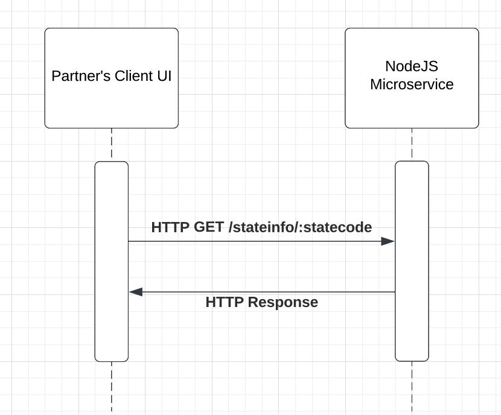

# CS361-Microservice

## Summary
Microservice for my partner's project in my CS 361 class.

## How to run

```
npm install
npm start
```
This will start the service on http://localhost:3000/

## How to request state highest point/mountain data:

The client should issue a HTTP GET request: GET /stateinfo/:statecode
For example, using curl :
```
  curl localhost:3000/stateinfo/WA
```
would issue a HTTP GET request to the /stateinfo/WA path on the localhost:3000 endpoint

## How to receive data:

The HTTP response will contain the requested data.

For example, the request above with the state code WA will receive a HTTP 200 OK response with this JSON data:
```
{
   state: "Washington",
   highest_natural_point: "Mount Rainier (Tahoma)",
   elevation: ": 14,417 ft (4,394 m)",
   prominence: "13,246 ft (4,037 m)",
   rank: 4,
   location: "Mount Rainier National Park and part of the Cascade Range",
 }
```
## UML Diagram


